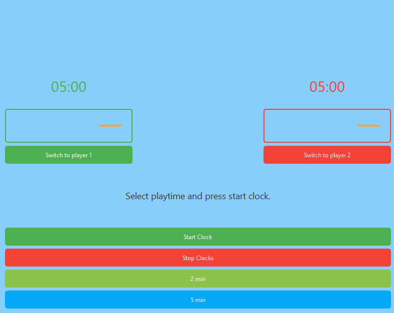

# Olio-ohjelmointi
Object-Oriented Programming (OOP) course in Oulu University of Applied Science

## Tehtävä 1

Tässä tehtävässä toteutetaan numeroarvauspeli, jossa pelaajan tulee arvata tietokoneen arpoma satunnainen luku.

### 1. Perusversio (main-funktiossa)
- Arvotaan satunnainen luku väliltä 1-20.
- Pyydetään pelaajalta arvaus.
- Ilmoitetaan, onko arvaus pienempi, suurempi tai oikea.
- Toistetaan, kunnes pelaaja arvaa oikein.

### 2. Funktiointiin siirtäminen
- Siirretään pelilogiikka omaan funktioonsa:

```cpp
int game();
```

- Lasketaan arvausten määrä ja palautetaan se pääohjelmaan.

### 3. Parametrisoitu versio
- Lisätään funktiolle parametri maxnum, joka määrittää suurimman arvottavan luvun:

```cpp
int game(int maxnum);
```
    
- Pääohjelmassa tulostetaan pelin loputtua arvausten määrä.

#### Muut huomioitavat asiat
- Käytetään satunnaislukugeneraattoria (cstdlib ja ctime).
- Arvottu luku saadaan rajoitettua modulo-operaattorilla.
- Tulostetaan debug-tietoa ohjelman toiminnan varmistamiseksi.

## Tehtävä 2

**Tässä tehtävässä Tässä tehtävässä toteutetaan viikkotehtävän 1 mukainen numeroarvauspeli oliopohjaisesti käyttäen Game-luokkaa.** 

### Game-luokka
-Konstruktori:
    - Saa parametrina ```maxNumber```, joka määrittää arvottavan luvun alueen (1 - maxNumber).
    - Arpoo arvattavan luvun.
    - Tulostaa debug-tietoa.
- ```void Play()```
    - Toteuttaa pelilogiikan (kysyy arvauksia, antaa vihjeitä).
    - Laskee arvausten määrän.
- ```void printGameResult()```
    - Tulostaa oikean luvun ja arvausten määrän pelin päätyttyä.

### Ohjelman tiedostorakenne
1. ```Game.h``` - Luokan otsikkotiedosto
2. ```Game.cpp``` - Luokan toteutustiedosto
3. ```main.cpp``` - Luo ```Game```-olion ja käynnistää pelin


### Lisävaatimukset
- Debug-tulostukset konstruktoriin ja jäsenfunktioihin.
- Testaa ohjelman toiminta varmistamalla, että peli etenee oikein.

## Tehtävä 3

**Tässä tehtävässä harjoitellaan perintää kahden luokan avulla:** 

### 1. Chef-luokka:
- Konstruktori ottaa parametrinä kokin nimen.
- Jäsenfunktiot ```makeSalad(int ingredients)``` ja ```makeSoup(int ingredients)```, jotka palauttavat valmistettujen annosten määrän.
    - Salaatti: 1 annos = 5 ainesta
    - Keitto: 1 annos = 3 ainesta
- Kaikki metodit, konstruktori ja destruktori tulostavat debug-tietoa.

### 2. ItalianChef-luokka (perii Chef-luokan):
- Lisää jäsenmuuttujan salasanalle (```password = "pizza"```).
- Jäsenfunktio ```askSecret(string givenPassword, int flour, int water)```:
    - Tarkistaa, onko salasana oikein.
    - Jos oikein, kutsuu ```makePizza(int flour, int water)```.
- ```makePizza``` (privaatti):
    - 1 pizza = 5 jauhoa + 5 vettä.
    - Palauttaa valmistettujen pizzojen määrän.

**Tavoitteena on toteuttaa luokat annettujen määrittelyjen mukaan ja varmistaa, että perintä toimii oikein.** 

## Tehtävä 4

**Tässä tehtävässä harjoitellaan yhdistelmäolioiden käyttöä ja perintää pankkitili- ja luottotili-luokkien avulla.**
**Tavoitteena on mallintaa pankkitilejä, luottoja ja asiakastoimintoja käyttäen perintää ja yhdistelmäolioita.**

### 1. Pankkitili-luokka (```Pankkitili```)
- ```deposit(double amount)``` - Tallettaa rahaa tilille (ei negatiivisia talletuksia).
- ```withdraw(double amount)``` - Nostaa rahaa tililtä (ei negatiivisia nostoja, saldo ei saa mennä alle 0).
- ```getBalance()``` - Palauttaa tilin saldon.
- Virtuaaliset metodit, jotta perityt luokat voivat muokata toimintaa.

### 2. Luottotili-luokka (```Luottotili```) (perii ```Pankkitili```)
- Konstruktori saa parametrina nimen ja henkilökohtaisen luottorajan.
- ```withdraw(double amount) override``` - Nostaa rahaa luottotililtä (ei negatiivisia nostoja, mutta tilin saldo voi mennä miinukselle luottorajaan asti).
- ```deposit(double amount) override``` - Maksaa luottovelkaa (ei voi maksaa enempää kuin on velkaa, saldo ei saa ylittää nollaa).
- ```getBalance()``` palauttaa saldon.

### 3. Asiakas-luokka (```Asiakas```)
- Jäsenmuuttujat:
    - ```Pankkitili pankkitili```
    - ```Luottotili luottotili```
- Konstruktori saa asiakkaan nimen ja luottorajan.
- ```showSaldo()``` - Tulostaa molempien tilien saldot.
- ```talletus(double amount)``` - Lisää rahaa pankkitilille.
- ```nosto(double amount)``` - Nostaa rahaa pankkitililtä.
- ```luotonMaksu(double amount)``` - Maksaa velkaa luottotililtä.
- ```luotonNosto(double amount)``` - Nostaa rahaa luottotililtä.

### 4. TiliSiirto Asiakkaiden Välillä
- ```tiliSiirto(double amount, Asiakas& vastaanottaja)```
    - Siirtää rahaa asiakkaan pankkitililtä toisen asiakkaan pankkitilille.
    - Ei voi tehdä siirtoa, jos saldo ei riitä.

### Ohjelman tiedostorakenne
1. ```Pankkitili.h / Pankkitili.cpp``` - Pankkitili-luokan määrittely ja toteutus.
2. ```Luottotili.h / Luottotili.cpp``` - Luottotili-luokan määrittely ja toteutus.
3. ```Asiakas.h / Asiakas.cpp``` - Asiakas-luokan määrittely ja toteutus.
4. ```main.cpp``` -  Luo Asiakas-olioita, suorittaa tilisiirtoja ja testaa logiikkaa.


## Tehtävä 5
**Tässä tehtävässä toteutetaan Notifikaattori-järjestelmä, joka käyttää osoittimia ja linkitettyä listaa seuraajien hallintaan.**
**Tavoitteena käyttää osoittimia ja linkitettyä listaa seuraajien hallintaan dynaamisesti!**

### 1. Seuraaja-luokka ( ```Seuraaja ```)
-  ```string nimi ``` - Seuraajan nimi.
-  ```Seuraaja* next ``` - Osoitin seuraavaan seuraajaan (käytetään linkitetyn listan rakentamiseen).
-  Konstruktori - Asettaa seuraajan nimen ja alustaa  ```next = nullptr ```.
-  ```paivitys(string viesti) ``` - Tulostaa viestin konsolille ("[nimi] sai viestin: [viesti]").
-  ```getNimi() ``` - Palauttaa seuraajan nimen.

### 2. Notifikaattori-luokka (```Notifikaattori```)
- ```Seuraaja* alku``` - Osoitin listan ensimmäiseen seuraajaan.
- Konstruktori - Alustaa ```alku = nullptr```.
- ```void lisaa(Seuraaja* uusi)``` - Lisää uuden seuraajan listan alkuun.
- ```void poista(string nimi)``` - Poistaa tietyn nimisen seuraajan listalta.
- ```void tulosta()``` - Tulostaa kaikkien seuraajien nimet.
- ```void postita(string viesti)``` - Lähettää viestin kaikille seuraajille kutsumalla ```paivitys()```-funktiota.

### 3. Linkitetyn listan käsittely

#### Lisäys (```lisaa()```)
1. Asetetaan uuden seuraajan ```next``` osoittamaan nykyiseen alkuun.
2. Päivitetään ```alku``` osoittamaan uuteen seuraajaan.
    - Ennen: ```alku -> B```
    - Lisätään A: ```A -> B``` ja ```alku = A```

#### Poisto (```poista()```)
1. Etsitään poistettava seuraaja.
2. Jos löytyy, päivitetään edellisen ```next``` osoittamaan seuraajan ```next```.
    - Ennen: ```A -> B -> C```
    - Poistetaan B: ```A -> C``` (B ohitetaan)

####Listan läpikäynti (```tulosta()``` ja ```postita()```)
- ```while (o != nullptr)```
    - Käydään lista läpi ```next```-osoittimen avulla, kunnes saavutetaan ```nullptr```.


### 4. Ohjelman tiedostorakenne
- ```Seuraaja.h``` - Seuraaja-luokan määrittely ja toteutus.
- ```Notifikaattori.h```  - Notifikaattori-luokan määrittely ja toteutus.
- ```main.cpp```  Luo Notifikaattori-olion, lisää seuraajia, poistaa heitä ja testaa viestien lähettämistä.

## Tehtävä 6

**Tehtävässä hyödynnetään C++ standardikirjastoa (`vector`, `algorithm`, `string`) opiskelijoiden hallintaan**
**Tavoitteena harjoitella C++ standardikirjaston käyttöä ja tietorakenteita (`vector`, `algorithm`).**

### Tehtävän Ydinasiat

1. `Student`-luokka
    - Jäsenmuuttujat: `name (string)`, `age (int)`.
    - Getterit & setterit (`getName()`, `getAge()`, `setName()`, `setAge()`).
    - `printStudentInfo()` - Tulostaa opiskelijan tiedot.
2. Pääohjelma (`main.cpp`)
    - Valikko: Käyttäjä voi lisätä, tulostaa, järjestää ja etsiä opiskelijoita.
    - Tiedot tallennetaan `vector<Student>`-listaan.
    - `algorithm`-kirjaston funktiot (`sort()`, `find_if()`) käytössä.

### Pääohjelman Valinnat

| **Valinta** | **Toiminto** |
|:------------:|-------------|
| **0** | Lisää opiskelija `vector<Student>`-listaan. |
| **1** | Tulostaa kaikki opiskelijat. |
| **2** | Järjestää ja tulostaa opiskelijat **nimen** mukaan (`sort()`). |
| **3** | Järjestää ja tulostaa opiskelijat **iän** mukaan (`sort()`). |
| **4** | Etsii opiskelijaa nimellä (`find_if()`). |

### Keskeiset C++ Standardikirjaston Käytöt
1. `vector<Stduent>`
    - `push_back()` - Lisää opiskelijoita listaan.
    - `begin()` / `end()` - Käytetään `find_if()`- ja `sort()`-funktioissa.
2. `sort()` (`algorithm`)

    - Lambda-funktiota hyödyntäen:
```cpp
sort(studentList.begin(), studentList.end(), 
    [](const Student& a, const Student& b) { return a.getName() < b.getName(); });
```
3. `find_if()` (`algorithm`)
    - Käytetään opiskelijan hakemiseen nimen perusteella:
```cpp
auto it = find_if(studentList.begin(), studentList.end(), 
    [&name](const Student& student) { return student.getName() == name; });
```

## Tehtävä 7

**Tässä tehtävässä toteutetaan kaksi hyvin yksinkertaista Qt Widget -sovellusta, joissa on käyttöliittymät, jotka koostuu laskurista.**
**Ensimmäisessä sovelluksessa on kaksi nappia: "Count" ja "Reset". Laskuri kasvaa joka kerta, kun "Count"-nappia painetaan, ja nollautuu, kun "Reset"-nappia painetaan.**

**Tavoitteena tehtävässä on rakentaa käyttöliittymä Qt:ssa, toteuttaa peruslaskutoimituksia ja hallita käytttäjän syötteitä sekä niistä koituvia virheitä.**

### Tehtävän ydinasiat
- Käyttöliittymä:
    - `QPushButton`: "Count" ja "Reset" napit.
    - `QLineEdit`: Kenttä, joka näyttää laskurin nykyisen arvon.
- Toiminnallisuus:
    - `Count`-nappi: Lisää laskurista arvon yhdellä joka kerta, kun nappia painetaan.
    - `Reset`-nappi: Nollaa laskurin arvon.
- Qt Widgets:
    - Käytetään Qt:n tarjoamia komponentteja kuten `QPushButton`, `QLineEdit`, ja `QVBoxLayout` käyttöliittymän rakentamiseen.

### Pääpiirteet
- `QPushButton` nappien toiminta liitetään vastaaviin slotteihin, jotka päivittävät laskurin arvoja.
- Käytetään `QLineEdit` komponenttia laskurin arvon näyttämiseen.

**Toisessa sovelluksessa luodaan laskin-sovellus, joka mahdollistaa kahden käyttäjän syöttämän numeron laskemisen. Laskin tukee neljää perusoperaatiota: +, -, * ja /.**
**Käyttöliittymäsä on kentät, joihin käyttäjä voi syöttää numerot ja valita operaattorin, lopputulos näytetään erilisessä kentässä.**

### Tehtävän Ydinasiat
- **Käyttöliittymä:**  
  - `QLabel`: Tekstikentät, jotka näyttävät otsikot "Number1", "Number2", ja "Result". Nämä eivät ole vuorovaikutteisia kenttiä.
  - `QLineEdit`: Kentät, joissa käyttäjä voi syöttää lukuja. Nämä on nimetty `num1`, `num2`, ja `result`.
  - `QPushButton`: Nämä napit suorittavat laskutoimituksia ja tyhjentävät kentät. Nimeä napit `N0`, `N1`, `N2`, ... `N9` numeroille, ja `add`, `sub`, `mul`, `div` laskutoiminnoille sekä `clear` ja `enter` toiminnoille.

- **Toiminnallisuus:**  
  - Käyttäjä voi syöttää kaksi lukua `num1` ja `num2`.
  - Laskutoimitukset suoritetaan nappeja painamalla ja tulos näkyy `result` kentässä.
  - Tukitoiminnot:  
    - `clear`: Tyhjentää kaikki kentät.
    - `enter`: Suorittaa laskutoimituksen ja näyttää tuloksen.
  
- **Laskutoimitukset:**  
  - `add` (lisäys)
  - `sub` (vähennys)
  - `mul` (kerto)
  - `div` (jako)
  - Jakamisessa käsitellään myös nolla jakajana (virhe).

### Käyttöliittymän Yksityiskohdat
- `QLabel`:  
  - Tekstit "Number1", "Number2", "Result".
  
- `QLineEdit`:  
  - `num1`: Ensimmäinen syöttökenttä numerolle 1.
  - `num2`: Toinen syöttökenttä numerolle 2.
  - `result`: Kenttä, johon laskutoimituksen tulos näytetään.

- `QPushButton`:  
  - `N0-N9`: Numeronäppäimet 0-9.
  - `add`: Lisäysoperaatio (plus).
  - `sub`: Vähennysoperaatio (miinus).
  - `mul`: Kertolaskuoperaatio (kertomerkki).
  - `div`: Jakolaskuoperaatio (vinoviiva).
  - `clear`: Tyhjentää syöttökentät ja tuloksen.
  - `enter`: Laskee valitun laskutoimituksen ja näyttää tuloksen.

## Toiminnallisuus:
- **Numerot** (`N0-N9`):  
  Käyttäjä voi syöttää numeroita kenttään `num1` ja `num2` käyttämällä numero-nappeja.
  
- **Laskutoimitukset** (`add`, `sub`, `mul`, `div`):  
  Käyttäjä voi valita laskutoimituksen (plus, miinus, kertominen tai jakaminen) ja tulos näytetään `result` kentässä.

- **Clear ja Enter**:  
  - `clear`: Tyhjentää kaikki kentät.
  - `enter`: Suorittaa laskutoimituksen, joka on valittu, ja näyttää sen tuloksen `result` kentässä.

## Tehtävä 8: Shakkikello Sovellus Qt Widgets

Tässä tehtävässä luodaan **Shakkikello-sovellus** käyttäen Qt Widgets -sovelluskehystä. Sovellus toimii ajastimena kahdelle pelaajalle, ja se seuraa kummankin pelaajan jäljellä olevaa peliaikaa. Käyttöliittymä näyttää molemmille pelaajille progressbarit, jotka osoittavat jäljellä olevan ajan.

### Tehtävän Ydinasiat
- **Käyttöliittymä:**  
  - **Pelikellot:** Käyttöliittymässä on kaksi `QProgressBar`-olionkenttää, jotka näyttävät kummankin pelaajan jäljellä olevan ajan.
  - **Painikkeet:**  
    - **Peliajat:** Käyttäjä voi valita peliajan kahdella painikkeella.  
    - **Start Game:** Pelin käynnistävä painike, joka käynnistää ajastimet.
    - **Switch Player:** Vaihda pelaajaa siirron jälkeen.
    - **End Game:** Pelin lopettaminen ja uuden pelin aloitus.

- **Toiminnallisuus:**
  - **Ajan valinta:** Käyttäjä voi valita peliajan valitsemalla yhden kahdesta vaihtoehdosta.
  - **Pelin aloitus:** Käyttäjä voi aloittaa pelin painamalla **Start Game** -painiketta, jolloin ajastimet alkavat laskea.
  - **Siirron vaihto:** Pelaaja 1 painaa **Switch Player** -painiketta siirtonsa jälkeen, jolloin ajastin vaihtuu pelaajalle 2.
  - **Ajan loppuminen:** Jos jommankin pelaajan aika loppuu (0 sekuntia), peli päättyy ja käyttäjä kehotetaan aloittamaan uusi peli.

### Käyttöliittymän Yksityiskohdat
- **QProgressBar:**  
  - `Player 1 ProgressBar`: Näyttää pelaaja 1:n jäljellä olevan ajan.
  - `Player 2 ProgressBar`: Näyttää pelaaja 2:n jäljellä olevan ajan.

- **QPushButton:**  
  - `Select Time 1`: Valitse ensimmäinen peliaika.
  - `Select Time 2`: Valitse toinen peliaika.
  - `Start Game`: Käynnistää pelin ja aloittaa ajastimet.
  - `Switch Player`: Vaihda pelaajaa siirron jälkeen.
  - `End Game`: Lopettaa pelin ja aloittaa uuden pelin.

### Toiminnallisuus
- **Peliajat valitseminen:** Käyttäjä voi valita kahdesta vaihtoehdosta peliajan.
- **Pelin ajastaminen:**  
  - Kun peli käynnistetään, pelaaja 1:n aika alkaa kulua.
  - Kun pelaaja 1 on valmis ja painaa **Switch Player** -painiketta, ajastin siirtyy pelaaja 2:lle.
- **Ajan loppuminen:**  
  - Jos pelaajan aika loppuu, peli päättyy ja käyttäjä voi aloittaa uuden pelin.

### Tavoitteet
- **Harjoitellaan Qt:n käyttöliittymäkomponenttien hallintaa** (`QProgressBar`, `QPushButton`).
- **Pelin logiikan toteuttaminen ajastimien ja pelaajasiirtojen kanssa.**
- **Ajan hallinta ja virheenkäsittely pelissä.**

### Kuva Projektista

```markdown

